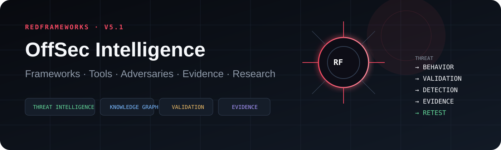
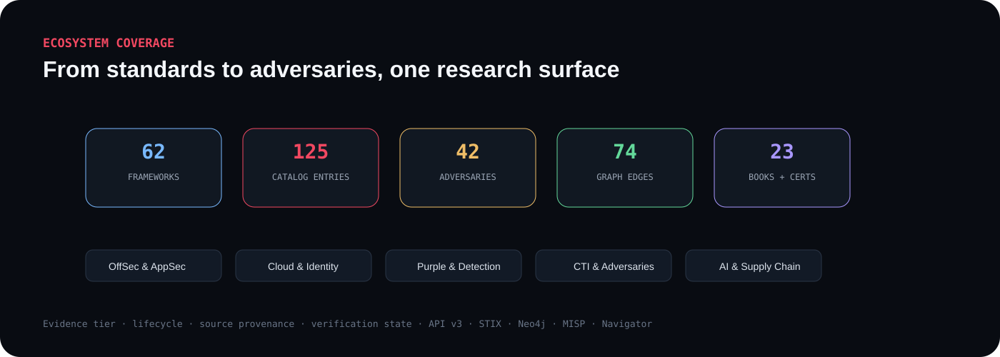
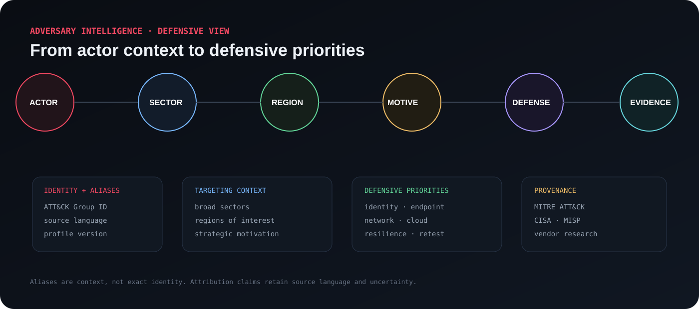
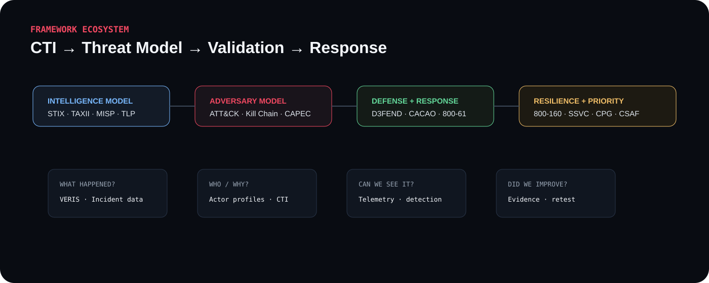
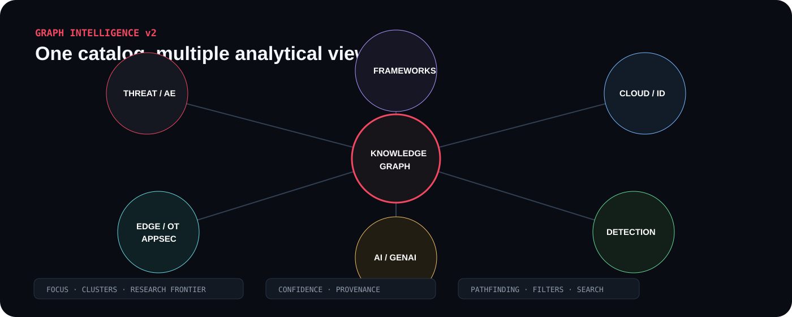

# RedFrameworks

### OffSec · CTI · Adversary Intelligence Knowledge Graph

**Methodologies · Threat Intelligence · Adversary Intelligence · OffSec · Cloud · AI Security · Purple Team · Detection Validation · Evidence Engineering**

[**Live Knowledge Base**](https://ridd1kulusc0d3r.github.io/RedFrameworks/) ·
[**Roadmaps**](docs/roadmaps/README.md) ·
[**Static API**](docs/api.md) ·
[**Gap Analysis**](docs/gap-analysis.md) ·
[**Contributing**](CONTRIBUTING.md)

  
  
  
  
  

---

## What is RedFrameworks?

RedFrameworks is a curated reference for **authorized penetration testing, threat-led red teaming, adversary emulation, purple-team validation, detection engineering and security research**.

It deliberately separates methodologies from tools, knowledge models from execution platforms, validation from mere activity, current projects from legacy references, and verified upstreams from research candidates.

The objective is not to collect every offensive-security repository on the internet. The internet is already handling that particular form of chaos rather efficiently.

> **What am I testing, why does it matter, how should it be modeled, what evidence should exist, and did defensive capability improve after the retest?**

---

## Live platform

**https://ridd1kulusc0d3r.github.io/RedFrameworks/**

The public site is generated directly from the repository data and includes:

- search and multi-dimensional filters;
- shareable URL state;
- EN / PT-BR / ES interface;
- factual comparison;
- CSV / JSON export;
- per-entity pages;
- provenance scores;
- knowledge-graph relationships;
- distribution and coverage visuals;
- standards/version intelligence;
- visible NOT VERIFIED research registry;
- scorecard and retest-regression dashboards;
- versioned Static API v3;
- reproducible snapshots and semantic diffs;
- books, certifications and objective-driven learning paths;
- command palette, bookmarks and graph path queries;
- Verification Engine and Research Workspace;
- Neo4j, MISP and ATT&CK Navigator exports;
- technique intelligence pages;
- STIX 2.1 export.

---

## Adversary intelligence

APT and cybercrime profiles are a **secondary analytical layer**. They connect public threat context to defensive priorities without turning the repository into an offensive playbook.

Current coverage includes **42 ATT&CK-tracked groups**, spanning state-sponsored, suspected state-linked, cyber-espionage and cybercrime clusters. Coverage now includes APT1, APT3, APT5, APT12, APT16, APT17, APT18, APT19, APT28, APT29, APT30, APT33, APT37, APT38, APT39, APT41, APT42, Sandworm, Turla, Lazarus Group, Kimsuky, MuddyWater, Volt Typhoon, Salt Typhoon, Mustang Panda, Scattered Spider, FIN7 and others.

Each profile records:

- ATT&CK group ID and aliases;
- source-attributed actor type and attribution language;
- strategic motivation;
- broad regions and sectors;
- defensive focus areas;
- ATT&CK profile version and provenance.

See [Adversary Intelligence](docs/adversary-intelligence.md) · [Adversary Matrix](docs/adversary-matrix.md) · [CTI Framework Guide](docs/cti-frameworks.md).

---

## CTI framework stack

The CTI/IR layer includes STIX 2.1, TAXII 2.1, CACAO 2.0, FIRST TLP 2.0, FIRST CSIRT Services Framework 2.1, VERIS 1.3.1, NIST SP 800-61 Rev. 3, NIST SP 800-160 Vol. 2 Rev. 1, CISA CPGs, Cyber Kill Chain, MISP Galaxy, SSVC and CSAF 2.0.

v5.2 expands the broader catalog with **OWASP Top 10:2025, NIST SP 800-63-4, NIST SP 800-161 Rev. 1, NIST SP 800-190, CISA Zero Trust Maturity Model 2.0, OpenSSF OSPS Baseline, OWASP SCVS, CSA Security Guidance v5, ETSI EN 303 645 v3.1.3, ISO/IEC 27001:2022 and ISO/IEC 27005:2022**.

---

## Operating model

~~~mermaid
flowchart LR
    TI["Threat Intelligence"] --> BEH["Behavior / Scenario"]
    BEH --> SCOPE["Scope + Rules of Engagement"]
    SCOPE --> TEST["Controlled Validation"]
    TEST --> TEL["Telemetry"]
    TEL --> DET["Detection"]
    DET --> RESP["Analyst Response"]
    RESP --> REM["Remediation"]
    REM --> RETEST["Retest"]
    RETEST --> EVID["Evidence E0-E3"]

    style TI fill:#241117,stroke:#e0445e,color:#fff
    style EVID fill:#12241b,stroke:#5dd59a,color:#fff
~~~

A mature engagement does not stop at “we obtained access.” It records what was observable, what was detected, what response occurred, which control changed and whether that change survived retesting.

---

## Knowledge graph

~~~mermaid
flowchart TD
    ATTACK["MITRE ATT&CK"]
    ATLAS["MITRE ATLAS"]
    D3FEND["MITRE D3FEND"]
    FLOW["Attack Flow"]
    ATOMIC["Atomic Red Team"]
    CALDERA["MITRE CALDERA"]
    TTP["TTPForge"]
    SIGMA["Sigma"]
    VECTR["VECTR"]
    OPENAEV["OpenAEV"]
    PYRIT["PyRIT"]
    GARAK["garak"]

    ATTACK --> ATOMIC
    ATTACK --> CALDERA
    ATTACK --> TTP
    ATTACK --> SIGMA
    ATTACK --> D3FEND
    ATTACK --> FLOW
    ATTACK -. AI context .-> ATLAS
    OPENAEV --> ATTACK
    ATTACK --> VECTR
    ATLAS --> PYRIT
    ATLAS --> GARAK

    style ATTACK fill:#40151f,stroke:#ff778c,color:#fff
    style ATLAS fill:#1c2433,stroke:#8fc5ff,color:#fff
    style D3FEND fill:#14281e,stroke:#5dd59a,color:#fff
~~~

**Graph Explorer:** https://ridd1kulusc0d3r.github.io/RedFrameworks/graph/

Canonical graph data: [relationships.yaml](relationships.yaml)

---

## Six-layer ecosystem

| Layer | Main question | Examples |
|---|---|---|
| **Methodology & assurance** | How should the engagement be governed? | PTES, NIST SP 800-115, TIBER-EU, CBEST |
| **Knowledge models** | How do we describe behavior and defense? | ATT&CK, ATLAS, D3FEND, Attack Flow |
| **Emulation & validation** | How do we reproduce behavior safely? | Atomic Red Team, CALDERA, TTPForge, OpenAEV |
| **Operational assessment** | Which platform supports the authorized test? | BloodHound, CloudFox, Pacu, MobSF |
| **Detection & response** | How do we represent and validate defense? | Sigma, Velociraptor, VECTR, Splunk Attack Range |
| **Domain guidance** | What changes for a specific technology? | WSTG, MASTG, IoT ISTG, cloud guidance |

See [taxonomy](docs/taxonomy.md).

---

## Choose by objective

| Objective | Start with | Add |
|---|---|---|
| Traditional penetration test | PTES | NIST SP 800-115 |
| Web application assessment | OWASP WSTG | PTES |
| Threat-led testing | TIBER-EU / CBEST / CREST TLPT | ATT&CK + Attack Flow |
| Purple-team validation | ATT&CK | Atomic Red Team + VECTR + Sigma |
| Cloud assessment | PTES + provider rules | CloudFox + Stratus + attack-path analysis |
| Kubernetes | cloud-native threat model | KubeHound + validation tooling |
| AI / GenAI | OWASP GenAI + ATLAS | NIST AI RMF + PyRIT / garak |
| Mobile | OWASP MASVS / MASTG | MobSF + dynamic instrumentation |
| IoT / embedded | OWASP IoT ISTG / ISVS | ecosystem-specific testing |
| Continuous validation | ATT&CK | OpenAEV / BAS + detection engineering |

---

## Data pipeline

~~~mermaid
flowchart LR
    F["frameworks.yaml"] --> V["Schema + Integrity Validation"]
    C["catalog.yaml"] --> V
    R["relationships.yaml"] --> V
    L["Lifecycle data"] --> V

    V --> N["Normalized Catalog"]
    N --> P["GitHub Pages"]
    N --> API["Static API"]
    N --> ENT["Entity Pages"]
    N --> STIX["STIX 2.1"]
    N --> GRAPH["Knowledge Graph"]

    HEALTH["Upstream Health"] --> N
    FRESH["Freshness Review"] --> N

    style V fill:#22131a,stroke:#e0445e,color:#fff
    style N fill:#111b25,stroke:#8fc5ff,color:#fff
    style GRAPH fill:#12241b,stroke:#5dd59a,color:#fff
~~~

### Canonical data

| File | Purpose |
|---|---|
| [frameworks.yaml](frameworks.yaml) | methodologies, standards and knowledge models |
| [catalog.yaml](catalog.yaml) | verified, community, commercial, legacy and NOT VERIFIED research entries |
| [relationships.yaml](relationships.yaml) | curated graph edges |
| [resources.yaml](resources.yaml) | books and certifications |
| [learning-paths.yaml](learning-paths.yaml) | objective-driven paths across frameworks, tools and resources |
| [data/adversaries.yaml](data/adversaries.yaml) | source-attributed adversary intelligence profiles |
| [data/intelligence-sources.yaml](data/intelligence-sources.yaml) | curated CTI research sources |
| [data/lifecycle.yaml](data/lifecycle.yaml) | renames, legacy transitions and lifecycle events |
| [data/changelog.yaml](data/changelog.yaml) | machine-readable platform history |
| [schemas/](schemas/) | JSON Schemas and validation contracts |

---

## Provenance model

| Tier | Meaning |
|---|---|
| **A** | regulator, standard, foundation or primary official documentation |
| **B** | canonical maintainer repository or official vendor documentation |
| **C** | traceable community source |
| **D** | research candidate / insufficiently verified |

The generated site also computes a provenance score from evidence tier, review recency, lifecycle state and available upstream-maintenance signals.

A provenance score is a **curation signal**, not a universal ranking of political candidates, security products, breakfast cereals, or anything else humans enjoy ranking.

---

## Evidence engineering

~~~mermaid
flowchart LR
    E0["E0 · Claim"] --> E1["E1 · Observation"]
    E1 --> E2["E2 · Reproducible Evidence"]
    E2 --> E3["E3 · Correlated Evidence"]

    E3 --> SRC["Source event"]
    E3 --> TEL["Security telemetry"]
    E3 --> ALERT["Detection"]
    E3 --> RESP["Analyst response"]
    E3 --> RET["Retest"]

    style E0 fill:#281315,stroke:#8b1e1e,color:#fff
    style E3 fill:#11271b,stroke:#5dd59a,color:#fff
~~~

Structured examples:

- [Scenario schema](schemas/scenario.schema.json)
- [Validation scenarios](examples/scenarios/)
- [Evidence bundles](examples/evidence/)
- [Coverage trends](examples/trends/)
- [Evidence engineering](docs/evidence-engineering.md)

---

## Repository map

| Area | Contents |
|---|---|
| [docs/](docs/) | methodologies, taxonomy, reporting, evidence and domain guidance |
| [docs/roadmaps/](docs/roadmaps/) | platform, analyst, data, evidence and research roadmaps |
| [examples/attack-navigator/](examples/attack-navigator/) | ATT&CK Navigator layers |
| [examples/attack-flow/](examples/attack-flow/) | Attack Flow / STIX examples |
| [examples/scenarios/](examples/scenarios/) | structured defensive-validation scenarios |
| [examples/evidence/](examples/evidence/) | E0-E3 evidence examples |
| [schemas/](schemas/) | machine-readable contracts |
| [scripts/](scripts/) | validation, build, freshness, upstream health and STIX export |
| [site/](site/) | static web interface |
| [.github/workflows/](.github/workflows/) | CI, Pages, review automation and releases |

---

## Roadmaps

~~~mermaid
flowchart LR
    V1["v1 · Knowledge Base"] --> V2["v2 · Interactive Catalog"]
    V2 --> V3["v3 · Knowledge Graph"]
    V3 --> V4["v4 · Continuous Intelligence"]
    V4 --> V5["v5 · Ecosystem API"]

    style V1 fill:#14261d,stroke:#5dd59a,color:#fff
    style V2 fill:#14261d,stroke:#5dd59a,color:#fff
    style V3 fill:#40151f,stroke:#ff778c,color:#fff
~~~

- [Platform roadmap](docs/roadmaps/platform-roadmap.md)
- [Analyst roadmap](docs/roadmaps/analyst-roadmap.md)
- [Data & provenance roadmap](docs/roadmaps/data-roadmap.md)
- [Evidence roadmap](docs/roadmaps/evidence-roadmap.md)
- [Research promotion roadmap](docs/roadmaps/research-roadmap.md)

---

## Research registry

All previously separate research candidates are now included directly in the catalog.

They are explicitly marked:

~~~yaml
status: "not-verified"
evidence_tier: "D"
verification_note: "NOT VERIFIED — research candidate only."
~~~

This makes the catalog complete without converting unverified names into recommendations.

See [Research Registry](docs/watchlist.md) and [Verification Backlog](docs/gap-analysis.md).

---

## Automation

| Workflow | Purpose |
|---|---|
| **Documentation quality** | links, schemas, integrity, examples, STIX and site build |
| **Catalog freshness** | review-date cadence |
| **Standards intelligence** | primary-source ATT&CK / ATLAS / D3FEND / OWASP / NIST version change detection |
| **Upstream health review** | archive, availability, activity and release signals |
| **Catalog contribution review** | PR taxonomy / schema / reference validation |
| **Build and deploy knowledge base** | Pages, API, entity pages and STIX |
| **Versioned catalog release** | release assets for v* tags |

---

## Static API v3 & interoperability

Documentation: [docs/api.md](docs/api.md)

~~~text
/api/version.json
/api/v1/catalog.json
/api/v2/catalog.json
/api/v2/not-verified.json
/api/v2/standards.json
/api/v2/successors.json
/api/v2/relationships.json
/api/v2/ai-crosswalk.json
/api/v2/attack-d3fend.json
/api/redframeworks-stix-2.1.json
~~~

Consumer examples are available for Python, TypeScript and shell.

---

## Safety & authorization

RedFrameworks is intended for authorized security testing, labs, defensive validation, threat-informed research and detection/response engineering.

Before execution, define authorization, scope, exclusions, stop conditions, evidence handling and production-impact constraints.

The repository focuses on **methodology, modeling, evidence and defensive validation**, not destructive operational procedures.

---

## Project status

### Platform v5.2 · Graph Intelligence + Expanded Research Portal

| Capability | Status |
|---|---|
| Complete visible catalog incl. NOT VERIFIED | ✅ |
| Standards/version intelligence | ✅ |
| Primary-source version watcher | ✅ |
| Relationship provenance | ✅ |
| ATT&CK ↔ D3FEND examples | ✅ |
| AI security crosswalks | ✅ |
| Longitudinal scorecard metrics | ✅ |
| Retest regression detection | ✅ |
| Reproducible snapshots | ✅ |
| Semantic release diffs | ✅ |
| Static API v3 + v1/v2 compatibility | ✅ |
| Books & certifications | ✅ |
| Learning paths | ✅ |
| Verification Engine | ✅ |
| Graph path queries | ✅ |
| Technique Intelligence | ✅ |
| Adversary Intelligence profiles (42) | ✅ |
| CTI source library | ✅ |
| CTI / IR / resilience frameworks | ✅ |
| Identity / supply-chain / cloud / IoT framework expansion | ✅ |
| Full-screen Graph Intelligence explorer | ✅ |
| GitHub Pages Actions-only deployment guard | ✅ |
| Neo4j / MISP / Navigator exports | ✅ |
| Command palette & bookmarks | ✅ |
| OpenCTI interoperability | ✅ |
| Redesigned Pages UI | ✅ |

See [CHANGELOG.md](CHANGELOG.md) and [v6 roadmap](docs/next-evolutions.md).

---

## Contributing

Contributions should improve decision quality, provenance, repeatability, defensive measurement, evidence quality, taxonomy or interoperability.

Read [CONTRIBUTING.md](CONTRIBUTING.md) and [review policy](docs/review-policy.md) before promoting a new entry.

---

**RedFrameworks**

*Threat → Behavior → Validation → Detection → Evidence → Retest*

[Live Knowledge Base](https://ridd1kulusc0d3r.github.io/RedFrameworks/) · [API](docs/api.md) · [Roadmaps](docs/roadmaps/README.md)

