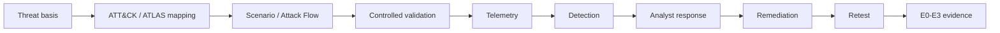

# Evidence Engineering

RedFrameworks treats evidence as a first-class output of authorized security validation.

## Scenario chain

## Structured scenario

`examples/scenarios/identity-detection-validation.yaml` demonstrates the reusable scenario schema without providing exploit instructions.

The schema connects:

- business context;
- threat basis;
- ATT&CK / ATLAS / D3FEND mappings;
- ordered validation objectives;
- expected telemetry;
- expected detections;
- response expectation;
- evidence target.

## Evidence bundle

`examples/evidence/e3-identity-evidence.yaml` shows what an E3 bundle should preserve:

- source event;
- security telemetry;
- detection output;
- analyst response;
- retest result;
- integrity / redaction metadata.

## Trend model

`examples/trends/coverage-trend.json` contains illustrative measurements for visualization. The values are examples, not claims about a real environment.

## Rule

A graph that rises nicely is not evidence by itself. Each measured improvement should point back to reproducible artifacts and a documented test condition.
