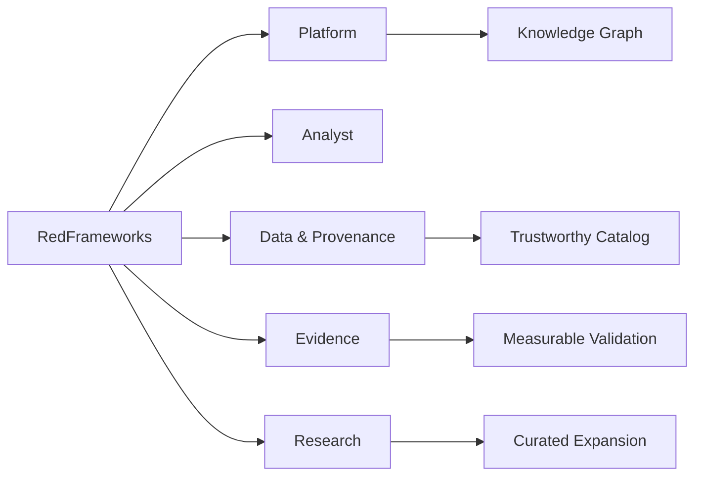

# RedFrameworks Roadmaps

RedFrameworks now separates roadmaps by concern instead of maintaining one eternal checkbox cemetery.

| Roadmap | Purpose |
|---|---|
| [Platform](platform-roadmap.md) | Product / architecture evolution |
| [Analyst](analyst-roadmap.md) | How an analyst should progress through the knowledge base |
| [Data & Provenance](data-roadmap.md) | Schema, curation, freshness and lifecycle intelligence |
| [Evidence](evidence-roadmap.md) | Move from activity to measurable defensive evidence |
| [Research](research-roadmap.md) | Promote research candidates into the verified core |

