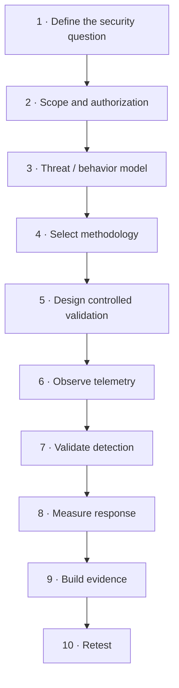

# Analyst Roadmap

The analyst roadmap is intentionally outcome-driven. It does not begin with "install 47 tools."

## Stage 1 — Question

Define:

- business service;
- asset / identity / application class;
- security hypothesis;
- required evidence.

## Stage 2 — Methodology

Choose the governing approach:

- PTES / NIST for general assessment;
- WSTG / MASTG / ISTG for domain testing;
- TIBER-EU / CBEST / CREST TLPT for relevant threat-led programs.

## Stage 3 — Behavior

Use ATT&CK, ATLAS or Attack Flow to describe behavior and sequence.

## Stage 4 — Validation

Choose validation tooling based on the objective, not popularity.

## Stage 5 — Defensive outcome

Measure:

- telemetry;
- detection;
- analyst recognition;
- containment;
- evidence quality;
- retest status.
