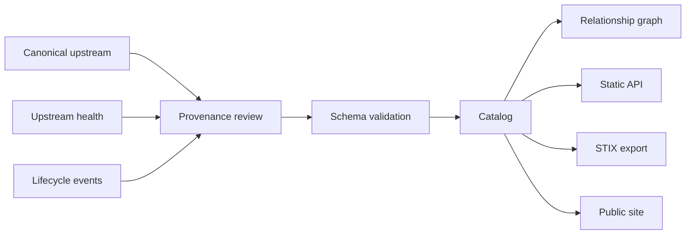

# Data & Provenance Roadmap



## Trust model

### Tier A

Official standard, regulator, foundation or primary project documentation.

### Tier B

Maintainer-controlled upstream or official vendor documentation.

### Tier C

Traceable community material.

### Tier D

Research candidate or unverified source.

## Automated controls

- JSON Schema validation;
- unique IDs;
- duplicate-name checks;
- broken relationship checks;
- watchlist overlap checks;
- URI validation;
- upstream archive/activity checks;
- release metadata;
- freshness review.

## Lifecycle states

```text
watchlist → community → verified
              ↓
            legacy
```

Entries can move backward when an upstream becomes archived, abandoned, renamed or superseded.
