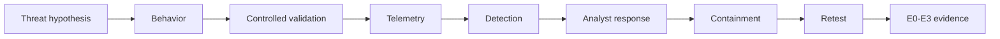

# Evidence Roadmap

## Evidence maturity

| Level | Meaning |
|---|---|
| E0 | claim only |
| E1 | manual observation / screenshot |
| E2 | reproducible technical evidence |
| E3 | correlated source event + security telemetry + analyst response |

## Target progression

### Baseline

Can the activity be observed?

### Detection

Does an analytic identify it with useful context?

### Response

Does the analyst recognize and handle it correctly?

### Retest

Did remediation or tuning survive a controlled repeat?

## Structured artifacts

- `schemas/scenario.schema.json`
- `examples/scenarios/`
- `examples/evidence/`
- `examples/trends/`
