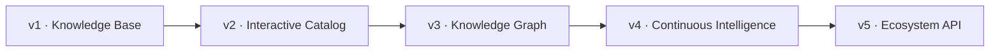

# Platform Roadmap

## v1 — Knowledge Base

Status: **complete**

- taxonomy;
- PTES / NIST / OWASP / threat-led guidance;
- evidence model;
- templates;
- framework and tooling catalogs.

## v2 — Interactive Catalog

Status: **complete**

- GitHub Pages;
- search / filters;
- ATT&CK Navigator examples;
- Attack Flow examples;
- relationship explorer;
- freshness automation.

## v3 — Knowledge Graph

Status: **current / implemented**

- JSON Schemas;
- cross-file integrity validation;
- provenance scoring;
- upstream lifecycle signals;
- per-entity pages;
- STIX 2.1 export;
- static API;
- factual comparison;
- CSV / JSON export;
- EN / PT-BR / ES presentation;
- evidence-engineering examples;
- versioned release pipeline.

## v4 — Continuous Intelligence

- deeper standards/version change monitoring;
- richer ATT&CK / ATLAS / D3FEND mapping;
- upstream successor intelligence;
- release-delta intelligence;
- coverage regression dashboards.

## v5 — Ecosystem API

- stable API versioning;
- generated SDK examples;
- external integrations;
- OpenCTI enrichment packages;
- catalog snapshots for research reproducibility.
