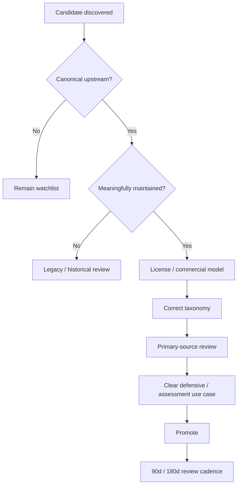

# Research Promotion Roadmap

Research candidates move into the verified catalog through evidence, not adjectives.

## Promotion gate

A candidate needs:

1. canonical upstream;
2. traceable maintainer or organization;
3. maintenance state;
4. license or commercial model;
5. correct classification;
6. supported domain;
7. primary use case;
8. review date;
9. evidence tier;
10. relationship to the existing ecosystem.

## Demotion gate

A verified entry can move to community or legacy if:

- upstream is archived;
- a successor is recommended;
- documentation disappears;
- compatibility becomes materially obsolete;
- maintenance becomes unclear.
